---

## Lab 1A (Arduino IDE & Artemis)

- **Blink**  
  <video src="images/Blink-video.mp4" controls style="max-width:100%; border-radius:8px;"></video>  
  [Open video](images/Blink-video.mp4) if it doesn’t play above.

- **Serial**  
  <video src="images/Example4_Serial-video.mp4" controls style="max-width:100%; border-radius:8px;"></video>  
  [Open video](images/Example4_Serial-video.mp4) if it doesn’t play above.

- **Temperature**  
  <video src="images/Example2_analogRead-video.mp4" controls style="max-width:100%; border-radius:8px;"></video>  
  [Open video](images/Example2_analogRead-video.mp4) if it doesn’t play above.

  [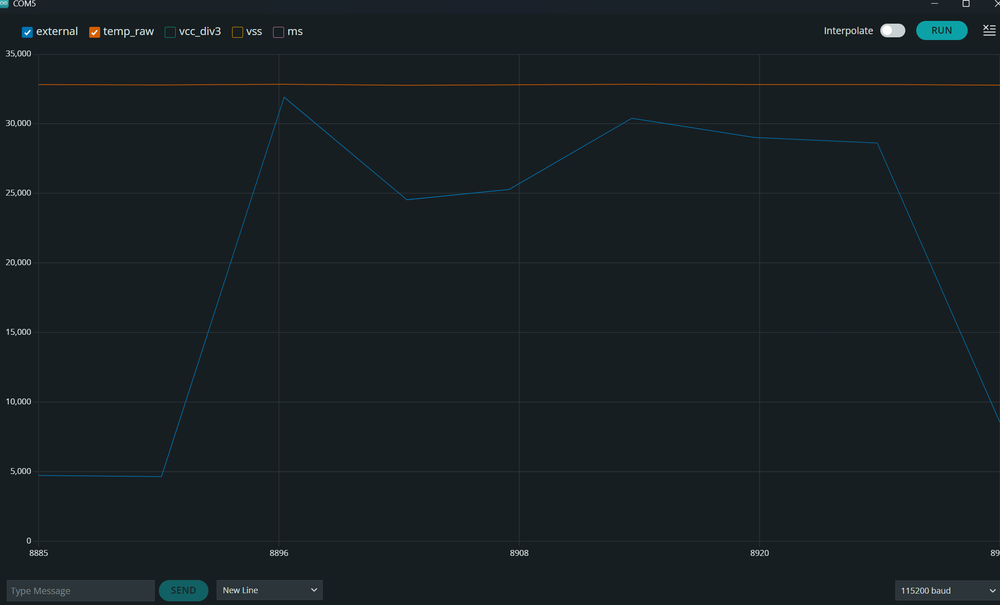](images/Example2_analogRead_Plot.png)

- **Microphone**  
  <video src="images/Example1_MicrophoneOutput-video.mp4" controls style="max-width:100%; border-radius:8px;"></video>  
  [Open video](images/Example1_MicrophoneOutput-video.mp4) if it doesn’t play above.

---

## Lab 1B – Configurations

- **Artemis MAC address:** in `connections.yaml`. 
```cpp
artemis_address: 'c0:81:b4:26:04:64'

ble_service: '7dbf6a36-a6ab-4d82-8bb6-803c5038ac15'

characteristics:
  TX_CMD_STRING: '9750f60b-9c9c-4158-b620-02ec9521cd99'

  RX_FLOAT: '27616294-3063-4ecc-b60b-3470ddef2938'
  RX_STRING: 'f235a225-6735-4d73-94cb-ee5dfce9ba83'
```
- **BLE service UUID:**

  [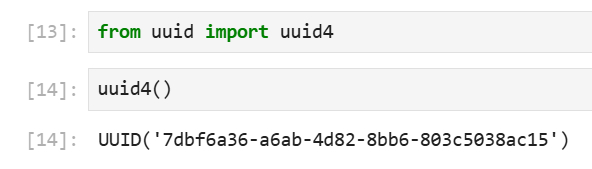](images/bluetooth-uuid.png)

BLE connection:

  [](images/connection-to-bluetooth-arduino.png)
  [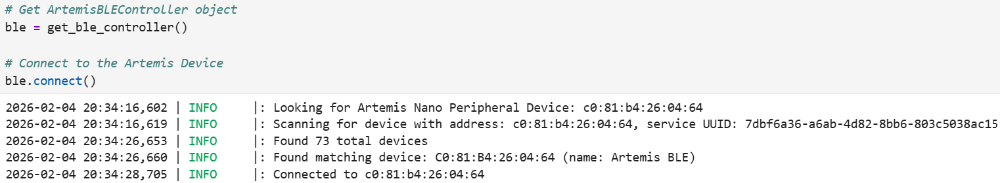](images/bluetooth-connected.png)

---

## Lab 1B – Tasks

### Task 1: ECHO command

I was able to send a string from the computer to the Artemis and receive an augmented string back.


```cpp
case ECHO:
    char char_arr[MAX_MSG_SIZE];

    success = robot_cmd.get_next_value(char_arr);
    if (!success)
        return;

    tx_estring_value.clear();
    tx_estring_value.append("Robot says -> ");
    tx_estring_value.append(char_arr);
    tx_estring_value.append(" :)");

    tx_characteristic_string.writeValue(tx_estring_value.c_str());
    Serial.print("Sent back: ");
    Serial.println(tx_estring_value.c_str());

    break;
```

Artemis reads the string with `get_next_value(char_arr)`, and builds:
 
  [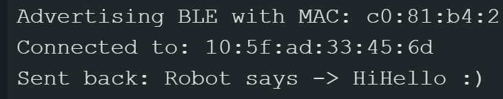](images/arduino-output-echo.png)

### Task 2: SEND_THREE_FLOATS

In this task I made the function to extract three floats and print them to the serial monitor.

**Jupyter (send command):**

```python
ble.send_command(CMD.SEND_THREE_FLOATS, "3.14|2.718|-1.5")
```

**Arduino (SEND_THREE_FLOATS case):**

```cpp
case SEND_THREE_FLOATS:
    float float_a, float_b, float_c;

    success = robot_cmd.get_next_value(float_a);
    if (!success)
        return;

    success = robot_cmd.get_next_value(float_b);
    if (!success)
        return;

    success = robot_cmd.get_next_value(float_c);
    if (!success)
        return;

    Serial.print("Three Floats: ");
    Serial.print(float_a);
    Serial.print(", ");
    Serial.print(float_b);
    Serial.print(", ");
    Serial.println(float_c);

    break;
```

Arduino serial monitor output:

  [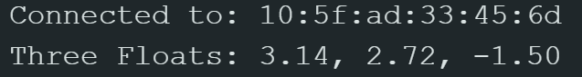](images/arduino-output-task2-floats.png)

### Task 3: GET_TIME_MILLIS

I added a command that reads the current time in milliseconds from the Artemis, formats it as a string `"T:<ms>"`, and writes it to the BLE string characteristic so the computer can read it.

**Arduino (GET_TIME_MILLIS case):**

```cpp
case GET_TIME_MILLIS:
    double t;
    tx_estring_value.clear();
    tx_estring_value.append("T:");
    t = millis();
    tx_estring_value.append(t);
    tx_characteristic_string.writeValue(tx_estring_value.c_str());

    break;
```

Time string printed and command in Jupyter:

  [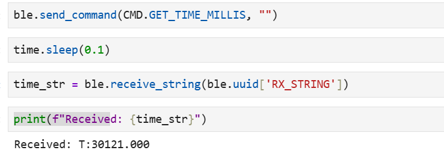](images/task3-time-and-command.png)

### Task 4: Notification handler for time string

I set up a notification handler in Python to receive the string value (BLEStringCharacteristic) from the Artemis; in the callback I parse the string and extract the time. I also tested it in a loop to see if it would print out, for fun.

  [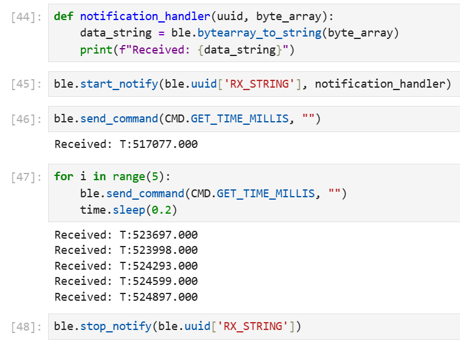](images/task4-function-and-command-output.png)

### Task 5: Loop – time in ms and data rate

To test the data transfer rate, I called GET_TIME_MILLIS repeatedly using the notification handler from Task 4. Each message is about 8–10 bytes. I sent a few messages over a little less than 3 seconds.

**Arduino (SEND_TIME_LOOP case):**

```cpp
case SEND_TIME_LOOP:
    // Send timestamps in a loop for performance testing
    for (int i = 0; i < 10; i++) {
        double t;
        tx_estring_value.clear();
        tx_estring_value.append("T:");
        t = millis();
        tx_estring_value.append(t);
        tx_characteristic_string.writeValue(tx_estring_value.c_str());
    }

    Serial.println("Sent 10 timestamps");

    break;
```

  [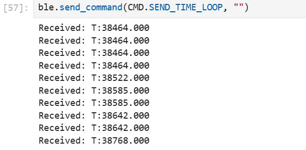](images/task5-command-output.png)

### Task 6: Timestamp array and SEND_TIME_DATA

I added global arrays and a tracking variable to store timestamps, and two new command types: one to collect timestamps into the array and one to send all stored timestamps over BLE. I also added the new command types in `cmd_types.py` in Jupyter.

**Global (Arduino):**

```cpp
#define ARRAY_SIZE 1000
double time_data[ARRAY_SIZE];
int time_index = 0;
```

**Collect timestamps (COLLECT_TIME_DATA case):**

```cpp
case COLLECT_TIME_DATA:
    time_index = 0;

    while (time_index < ARRAY_SIZE) {
        time_data[time_index] = millis();
        time_index++;
    }

    Serial.print("Collected ");
    Serial.print(time_index);
    Serial.println(" timestamps in array");

    break;
```

**Send all stored timestamps (SEND_TIME_DATA case):**

```cpp
case SEND_TIME_DATA:
    Serial.print("Sending ");
    Serial.print(time_index);
    Serial.println(" timestamps...");
    for (int i = 0; i < time_index; i++) {
        tx_estring_value.clear();
        tx_estring_value.append("T:");
        tx_estring_value.append(time_data[i]);
        tx_characteristic_string.writeValue(tx_estring_value.c_str());
    }

    Serial.println("Finished sending timestamps");

    break;
```

Arduino output when sending the timestamps:

  [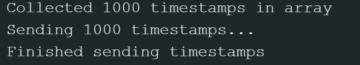](images/task6-arduino-output.png)

Jupyter commands used to test the timestamp array rate:

  [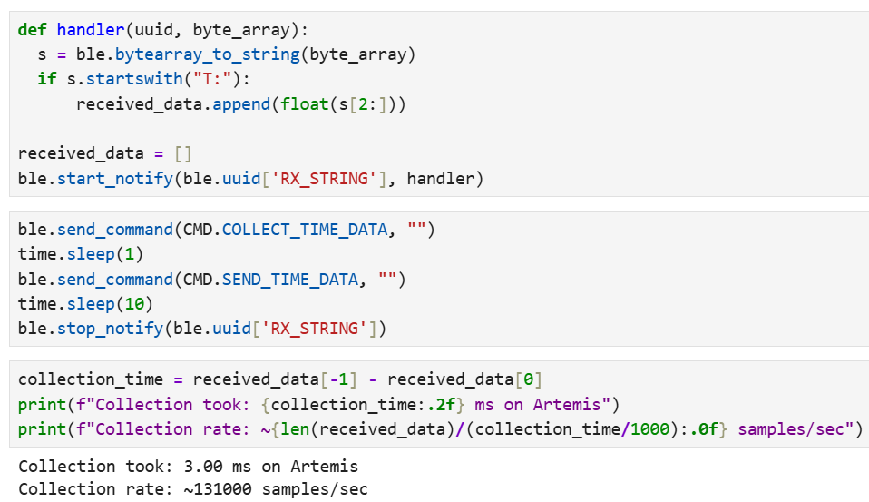](images/task6-jupyter-output.png)

### Task 7: Temperature array and GET_TEMP_READINGS

In this task I collected temperature readings with timestamps and stored them in two synchronized arrays (same index = same time); both were sent together via BLE as timestamp–temperature pairs.

**Arduino (GET_TEMP_READINGS case):**

```cpp
case GET_TEMP_READINGS:
    Serial.print("Sending ");
    Serial.print(time_index);
    Serial.println(" timestamp-temperature pairs...");
    for (int i = 0; i < time_index; i++) {
        tx_estring_value.clear();
        tx_estring_value.append("T:");
        tx_estring_value.append(time_data[i]);
        tx_estring_value.append("|TEMP:");
        tx_estring_value.append(temp_data[i]);
        tx_characteristic_string.writeValue(tx_estring_value.c_str());
    }

    Serial.println("Finished sending temperature data");

    break;
```

Jupyter commands:

  [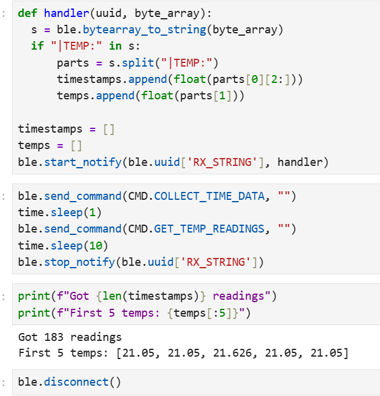](images/task7-jupyter-command-output.png)

Arduino output after running the commands:

  [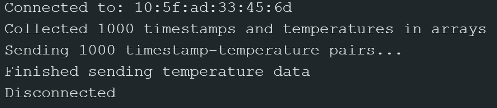](images/task7-arduino-ouput.png)

---

### Task 8: Discussion 

I learned that by differentiating the two methods from Task 5 and Tasks 6–7, Method 1 is fast because it sends data immediately. It essentially records the data, sends it via BLE, and repeats. Each send took about 20–40 ms. Method 2 was surprising because it was actually much faster than Method 1, even though it includes an extra step. Instead of sending immediately, it first records the data and stores it in an array, and then sends all the data via BLE afterward. Method 2 achieved about 0.015 ms per sample, which was calculated in Jupyter and shown in the previous images. Overall, I learned that Method 1 is more useful when the data changes slowly, such as temperature measurements. On the other hand, Method 2 is better suited for situations where events happen very quickly, such as IMU readings. Method 2 can record approximately 131,000 samples per second. Furthermore, since the Artemis RAM has 384 kB (384,000 bytes), and approximating each timestamp as about 8 bytes and each temperature value as about 8 bytes, each reading uses a total of 16 bytes. This means the system can store about 24,000 readings (384,000 / 16). Given the sampling rate of 131,000 samples per second, the system can record data for approximately 0.3 seconds before running out of memory.

---

### Collaboration:

I worked alone on this project. i referenced Trevor's website from last year for reference on how to setup my writeup and also to fix an error i was having on task 3.  

---